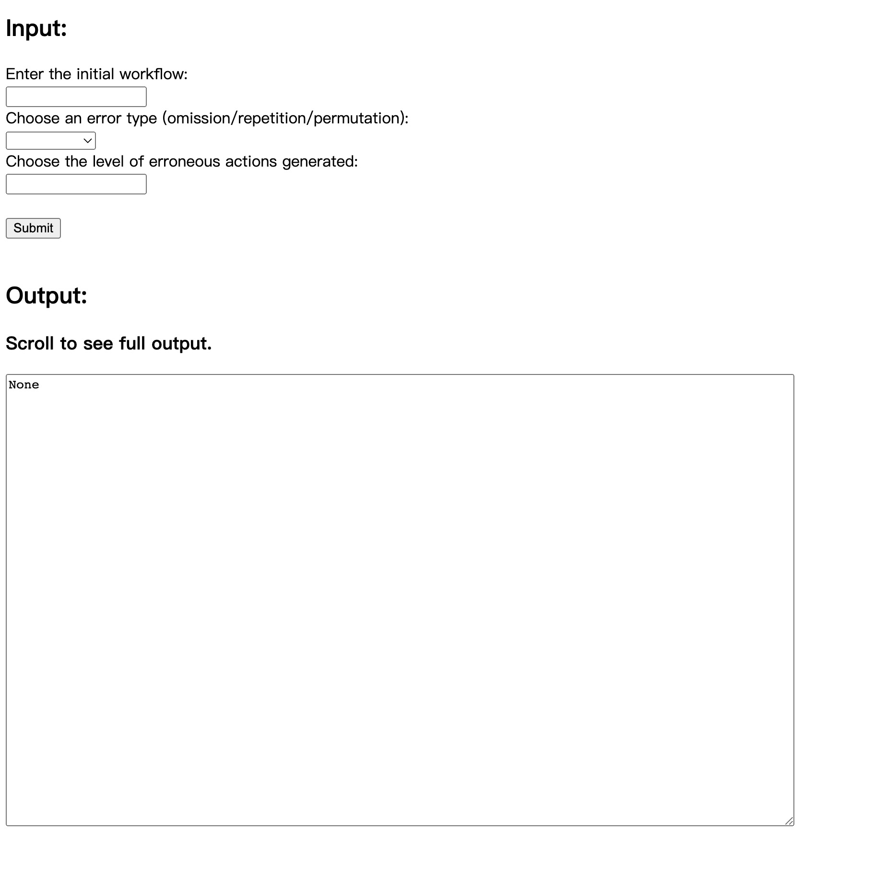

# DeviatedWorkflowsGenerator

<a href="https://deviatedworkflows-generator-4b34d2ce79de.herokuapp.com/">Click to access online Deviated Workflows Generator

  
## The interface

## Input format

### Enter the initial workflow
Enter the initial workflow that needs to be deviated. Use ; to separate each action.

Example:

Click on A;Enter prescription;Save

### Choose an error type
Choose from omission, repetition, or permutation.

Omission: [level] amount of action(s) are omitted.

Repetition: [level] amount of action(s) are repeated.

Permutation: [level+1] amount of action(s) are swapping positions.

### Choose the level of erroneous actions generated
Enter how many erroneous phenotypes of human action to generate.

Enter 0 to not include any.

## Generate deviated workflows
Click on <Submit> and the output will be displayed in the text box.
