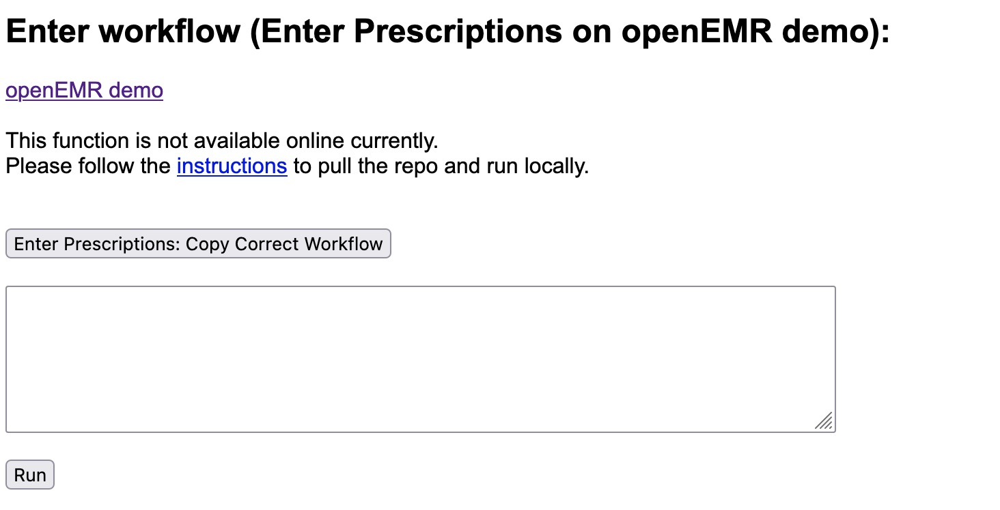

<h1>DeviatedWorkflowsGenerator</h1>

<a href="https://deviatedworkflows-generator-4b34d2ce79de.herokuapp.com/" target="_blank" rel="noopener noreferrer">Click to access online Deviated Workflows Generator</a>

<h1>Workflows Generator</h1>
<h2>Input format</h2>

<h3>Enter the initial workflow</h3>
Enter the initial workflow that needs to be deviated. Use ; to separate each action.  

Example: 
Click on A;Enter prescription;Save 

<h3>Choose an error type</h3>
Choose from omission, repetition, or permutation.  

Omission: [level] amount of action(s) are omitted. 
Repetition: [level] amount of action(s) are repeated. 
Permutation: [level+1] amount of action(s) are swapping positions.

<h3>Enter the level of erroneous actions generated</h3>
Enter how many erroneous phenotypes of human action to generate. 

Enter 0 to not include any.

<h2>Generate deviated workflows</h2>
Click on "Submit" and the output will be displayed in the text box.  
Click on "Download Output" to download generated deviated workflows as .txt file.  
Click on "Run Workflow" to open the Run Workflow page. 
Currently, this function only supports the "enter_prescriptions" workflow for openEMR demo. 
This function does not work online right now. Users need to pull the repository to set it up locally. 
Users could also download the source code enter_prescription.py from <a href="https://github.com/LeyiCui-Angel/AutoOpenEMRTesting" target="_blank" rel="noopener noreferrer">this repository</a> to test workflows locally.

<h1>Run Workflow</h1>
A browser automation script written in Selenium is implemented to interact with openEMR, a free, open-source online Electronic Health Records system.  
Specifically, this script is used to automate the process of entering a prescription into the OpenEMR system.  
Enter a workflow into the text area to automatically test the system's behavior. 
Correct enter prescriptions format: 
['click_provider','select_billy','click_drug','enter_drug_namep1','enter_drug_namep2','click_quantity','enter_quantity','enter_medicine_num','choose_medicine_unit','enter_direction_num','choose_direction_s1','choose_direction_s2','choose_direction_s3','choose_refill_num1','add_to_medicine','save']

<h2>Run the tool locally</h2>
1. Pull the GitHub repository. 
2. Install Flask. 
3. Navigate to the local directory of the repository in the terminal, run "flask run" 
4. Open the link shown in the terminal.

<h1>The interface</h1>

<h3>Before "Submit"<\h3>
 
<h3>After "Submit"</h3>
 
<h3>Run Workflow</h3>

